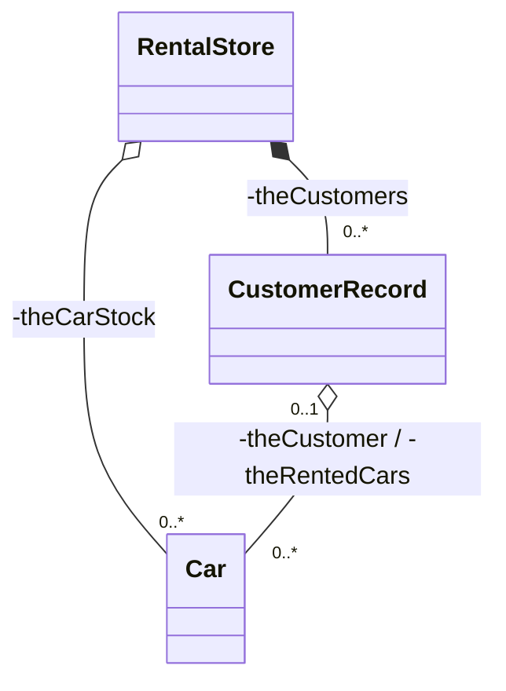

# 04 – Case Study – Hệ Thống Cho Thuê Xe (Car Rental Application)

**OBJECT-ORIENTED PROGRAMMING**

## 1. SPECIFICATION (ĐẶC TẢ)

**Cửa hàng thuê xe (Rental Store):**

- **Tên cửa hàng** (name).
    
- **Xe cho thuê (Cars):**
    
    - Tên dòng xe (model).
        
    - Hãng sản xuất (brand).
        
    - Biển số xe duy nhất (unique license plate).
        
- **Khách hàng (Customers):**
    
    - Tên khách hàng (name).
        
    - Đăng ký thuê một chiếc xe (rent a car).
        
    - Trả lại chiếc xe đã thuê (return a car).
        
- **Chức năng hệ thống:**
    
    - Đăng ký một khách hàng mới (register a new customer).
        
    - Hiển thị danh sách các xe:
        
        - Đang đậu ở bãi, có sẵn để cho thuê (available for rent).
            
        - Đã có khách hàng đang thuê (already rented out).
            

## 2. USE-CASES (CÁC CA SỬ DỤNG)

- Đăng ký một khách hàng mới vào hệ thống.
    
- Thêm một chiếc xe mới vào danh mục quản lý của cửa hàng.
    
- Xuất danh sách các chiếc xe hiện đang có sẵn tại bãi.
    
- Xuất danh sách các chiếc xe đang được khách hàng thuê.
    
- Ghi nhận một chiếc xe đã được giao cho khách hàng thuê thành công.
    
- Ghi nhận một chiếc xe đã được khách hàng trả lại cửa hàng.
    

## 3. TEST-CASES (KỊCH BẢN KIỂM THỬ)

1. **Register one customer:** Một khách hàng mới được đăng ký vào hệ thống cửa hàng thành công.
    
2. **Add one car:** Một chiếc xe mới được thêm vào kho dữ liệu và ở trạng thái sẵn sàng để cho thuê.
    
3. **Display available cars:** Hiển thị chi tiết từng chiếc xe đang trống khi hệ thống có từ 0 chiếc xe trở lên.
    
4. **Display rented cars:** Hiển thị chi tiết các chiếc xe đang được khách hàng thuê.
    
5. **Rent one car:** Một chiếc xe đang trống được ghi nhận là đã giao cho một khách hàng cụ thể và không còn hiển thị trong danh sách xe trống.
    
6. **Return one car:** Một chiếc xe đang được thuê được ghi nhận là đã trả lại. Chiếc xe này trở lại bãi đậu và ở trạng thái sẵn sàng cho thuê mới.
    

## 4. DESIGN - CLASS DIAGRAM DETAILS (CHI TIẾT THIẾT KẾ)

### Lược đồ quan hệ các lớp (Class Diagram)

Dưới đây là lược đồ thể hiện mối quan hệ giữa các lớp trong hệ thống (bao gồm Composition và Aggregation):

### Lớp RentalStore (Tương ứng Gym/Library)

- **Thuộc tính:** `-storeName: String`
    
- **Phương thức:**
    
    - `+RentalStore(String aName)`
        
    - `+registerCustomer(String aCustomerName)`
        
    - `+addNewCar(Car aCar)`
        
    - `+displayCarsAvailable()`
        
    - `+displayCarsRented()`
        
    - `+rentCar(String aLicensePlate, String aCustomerName)`
        
    - `+returnCar(String aLicensePlate)`
        

### Lớp Car (Tương ứng Package/Book)

- **Thuộc tính:**
    
    - `-licensePlate: String`
        
    - `-brand: String`
        
    - `-model: String`
        
- **Phương thức:**
    
    - `+Car(String plate, String brand, String model)`
        
    - `+attachCustomer(CustomerRecord aCustomer)`
        
    - `+detachCustomer()`
        
    - `+display()`
        

### Lớp CustomerRecord (Tương ứng MemberRecord)

- **Thuộc tính:** `-customerName: String`
    
- **Phương thức:**
    
    - `+CustomerRecord(String aName)`
        
    - `+attachCar(Car aCar)`
        
    - `+detachCar(Car aCar)`
        

## 5. IMPACT OF CLASSES (TÁC ĐỘNG CỦA CÁC LỚP)

- **Rent/Assign car:** Thực hiện kết nối một đối tượng `CustomerRecord` với một đối tượng `Car` và ngược lại (quan hệ 2 chiều).
    
- **Return car:** Ngắt kết nối giữa đối tượng `CustomerRecord` và đối tượng `Car`.
    
- **Check availability:** Một chiếc xe được coi là sẵn sàng cho thuê nếu thuộc tính liên kết với `CustomerRecord` là `NULL` (hoặc `nullptr` trong C++).